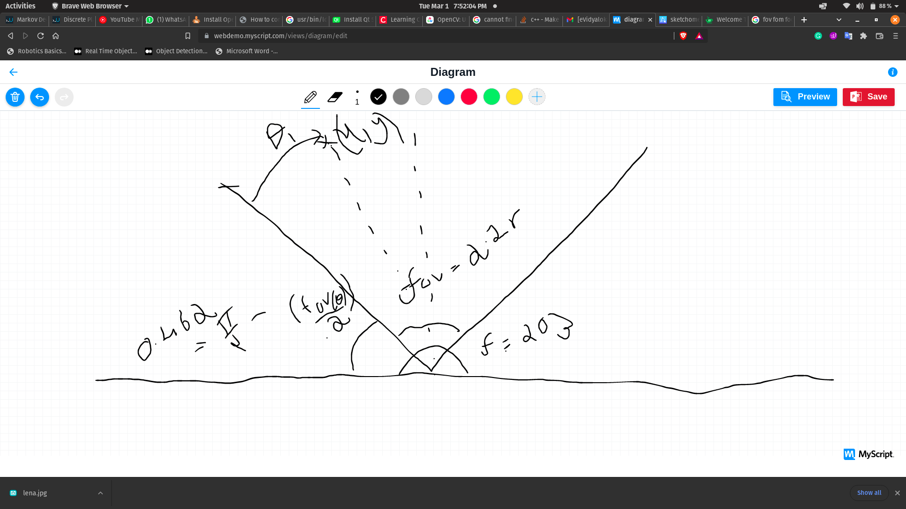

# Sensor Fusion and Kalman filter

## Sensor fusion
Sensor fusion is the process of combining sensor data or data derived from disparate sources such that the resulting information has less uncertainty than would be possible when these sources were used individually.

## Kalman filter
The Kalman filter is an algorithm (a step-by-step process) that helps people remove errors from numbers. It is named for Rudolf E. Kálmán, a mathematician who helped to make it.

Science can use the Kalman filter in many ways. One important use is steering airplanes and space ships. People also use the Kalman filter to make a model of how humans use nerves and muscles to move their bodies.

The Kalman filter has two steps. The first step is predicting (trying to say what you think will happen). The Kalman filter makes a first guess about what we think is true (an estimate) and how certain we are that it is true (uncertainty). Next, the Kalman filter makes a new guess by using a weighted average. More certain numbers are more important in this weighted average. After doing these two steps, we use the new guess to start these steps again.

## How to run
Make a catkin workspace clone this in the src folder then copy the .pt file in /weights folder you can comment the rosbag node to run it in real time but if you want to run a bag add the bag to /bag and add the name in detector.launch then run.
from src folder
```
cd ..
catin_make
source devel/setup.bash
roslaunch yolov5_pytorch_ros detector.launch
```
## Our optimiztation
We added a simple avreaging of the depth values from stereo camera and lidar we mapped these with credible accuracy and then sent these through a kalaman filter to smoothen the tracking of the objects we gave higher wieght to the lidar as its depth valuse are more reliable.

Our mapping was done by 
taking the FOV of the camera and then calulating the angle od detection and then the absolute angle by adding to the camera start angle from the horizontal.
we calculated fov = 2arctan(x/2f)
then we use simple geometery to calculate the angle detected this was then converted to index by using the angle/angle_diffrence.

